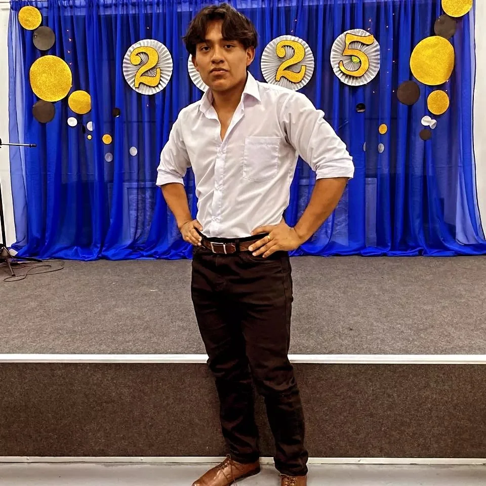

<!-- Banner Section -->

  
  
  ### 💻 Full-Stack Developer | Student at Tecsup

 

Welcome to my GitHub! I am a passionate developer focused on bridging the gap between robust backends and dynamic user interfaces. I love building applications from the ground up.

<!-- Profile Picture Section -->

   
  

---

## 🚀 About Me

* 🎓 **Studying:** Software Design and Development at **Tecsup**.
* 🌐 **Full-Stack Focus:** Experience building complete software lifecycles, from server logic to UI.
* ⚙️ **Backend:** Crafting RESTful APIs, optimizing databases, and writing clean server-side code.
* 🎨 **Frontend:** Designing and building modern, interactive, and responsive web interfaces.
* 🌱 **Goal:** Mastering scalable architectures to lead projects from end to end.

---

## 🛠️ Tech Stack

### Backend & Databases

### Frontend & Design

### Tools

---

## 🌟 Core Competencies

| ⚙️ Backend & Databases | 🎨 Frontend & UI/UX | 🧠 Practices & Soft Skills |
| :--- | :--- | :--- |
| **RESTful APIs** | **UI Development (React)** | **Version Control (Git)** |
| **SQL Queries & Modeling** | **UX Design Principles** | **Clean Code** |
| **Server Logic & Routing** | **Responsive Design** | **Problem Solving** |
| **Service Integration** | **Figma Prototyping** | **Agile & Teamwork** |

---

## 📊 GitHub Stats

---

## 📬 Let's Connect!

